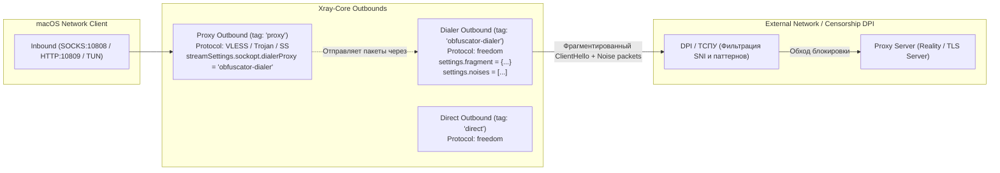

# 🏛️ Архитектурная спецификация и ADR: Интеграция возможностей Happ-proxy в X-project

**Дата:** 25 сентября 2026 г.  
**Автор:** Solution Architect  
**Статус:** Согласовано к реализации (Approved)  
**Репозиторий-донор:** [Happ-proxy](https://github.com/happ-proxy) (`happ-desktop`, `happ-android`, `happ-ios`)

---

## 1. Сравнительный анализ (Happ-proxy vs X-project)

| Категория | Happ-proxy | Текущий X-project | Целевое состояние X-project |
| :--- | :--- | :--- | :--- |
| **DPI: Фрагментация (Fragment)** | Глобальная + локальная настройка (`packets`, `length`, `interval`, `maxSplit`). Поддержка в заголовках подписок. | Поддерживается только пассивно из `rawJsonConfig` (UltimaVPN). Нет UI и глобального переключателя. | **Глобальная + индивидуальная настройка** в `NetworkTab` (пресеты: Mild, Aggressive, Custom), динамическая инъекция через `dialerProxy`. |
| **DPI: Шумы (Noises)** | Генерация рандомных байт, строк, hex, base64 с задержками (`noises-enable`, `noises-rand`, `delay`). | Отсутствует. | **Полноценная генерация шумов (Noise Injection)** в секции `freedom` outbound с настраиваемыми задержками и типами пакетов (`rand`, `base64`). |
| **Автозапуск системы** | Запуск при старте ОС в фоновом режиме / трее. | Есть только `autoConnectOnLaunch` (авто-подключение туннеля *при ручном запуске app*). Нет автозапуска при загрузке macOS. | **Запуск при входе в систему (Launch at Login)** через нативный `SMAppService.mainApp` (macOS 13.0+ Ventura / Sonoma / Sequoia). |
| **Доступ из локальной сети** | «Разрешить подключения из локальной сети» (Allow LAN). | Жестко зашит `127.0.0.1` (localhost). | Опция **«Разрешить подключения из локальной сети»** (бинд на `0.0.0.0`), позволяющая делиться VPN с iPhone, TV и другими устройствами. |
| **Замер задержки (Ping)** | TCP Ping + Real Proxy Delay (HTTP тест через туннель). | TCP Socket Ping (`LatencyTester`) + пост-валидация IP (`checkLiveProxyReachability`). | Добавление явного **«Реального пинга через прокси» (HTTP RTT)** к `https://cp.cloudflare.com/generate_204`. |
| **Схемы маршрутизации** | Собственный формат HAPP схем (`HappRoutingCodec`). | **Полная совместимость** (импорт/экспорт Base64 схем HAPP, авто-применение заголовка `routing:`). | Сохраняется и расширяется. |
| **Протоколы** | VLESS, VMess, Trojan, Shadowsocks, Socks5, Hysteria2. | VLESS (Reality, Vision, Flow, WS, gRPC), Trojan, Shadowsocks. | Добавление **VMess** и планирование **Hysteria 2**. |

---

## 2. Архитектурный дизайн (Architecture Design)

### 2.1. Механизм обхода DPI: Chained DialerProxy (Fragment + Noise)

Для того чтобы фрагментация и инъекция шумов работали **с любыми протоколами** (VLESS Reality, Trojan TLS, Shadowsocks), а не только с сырыми JSON-подписками, в Xray-core используется паттерн **Chained DialerProxy**:



#### Схема генерируемого JSON:
```json
{
  "outbounds": [
    {
      "tag": "proxy",
      "protocol": "vless",
      "settings": { ... },
      "streamSettings": {
        "network": "tcp",
        "security": "reality",
        "realitySettings": { ... },
        "sockopt": {
          "dialerProxy": "anti-dpi-dialer"
        }
      }
    },
    {
      "tag": "anti-dpi-dialer",
      "protocol": "freedom",
      "settings": {
        "domainStrategy": "AsIs",
        "fragment": {
          "packets": "tlshello",
          "length": "100-200",
          "interval": "10-20"
        },
        "noises": [
          {
            "type": "rand",
            "packet": "50-100",
            "delay": "10-20"
          }
        ]
      }
    },
    {
      "tag": "direct",
      "protocol": "freedom"
    },
    {
      "tag": "block",
      "protocol": "blackhole"
    }
  ]
}
```

> **Валидация:** Подтверждена официальным бинарником `Xray 26.3.27`: конфигурация с `sockopt.dialerProxy` и вложенными `fragment` и `noises` успешно проходит проверку `Configuration OK`.

---

### 2.2. Запуск при старте операционной системы (macOS Login Item)

В современных версиях macOS (13.0 Ventura, 14.0 Sonoma, 15.0 Sequoia) устаревший `SMLoginItemSetEnabled` и скрипты `launchd` заменены на **`SMAppService.mainApp`**:

```swift
import ServiceManagement

public enum LaunchAtLoginManager {
    public static var isEnabled: Bool {
        if #available(macOS 13.0, *) {
            return SMAppService.mainApp.status == .enabled
        }
        return false
    }
    
    public static func setEnabled(_ enabled: Bool) throws {
        if #available(macOS 13.0, *) {
            if enabled {
                if SMAppService.mainApp.status != .enabled {
                    try SMAppService.mainApp.register()
                }
            } else {
                if SMAppService.mainApp.status == .enabled {
                    try SMAppService.mainApp.unregister()
                }
            }
        }
    }
}
```

*Разграничение понятий в UI:*
1. **«Запуск приложения при входе в macOS»** (`launchAtLogin`): регистрирует приложение в системных настройках macOS («Основные» -> «Объекты входа»).
2. **«Автоподключение туннеля при старте программы»** (`autoConnectOnLaunch`): активирует VPN сразу после старта процесса X-project.

---

### 2.3. Модель данных: расширение AppSettings

Соблюдая **FEAT-PERSIST-03** (отказоустойчивая десериализация), расширяем `AppSettings`:

```swift
public struct AppSettings: Codable, Equatable {
    // ... Существующие поля ...
    
    // Новые поля:
    public var launchAtLogin: Bool
    public var allowLanConnections: Bool
    
    // Настройки DPI (Fragment & Noise)
    public var fragmentEnabled: Bool
    public var fragmentPackets: String // "tlshello" или "1-3"
    public var fragmentLength: String  // "100-200" или "50-100"
    public var fragmentInterval: String // "10-20"
    
    public var noiseEnabled: Bool
    public var noiseType: String       // "rand", "base64", "str"
    public var noisePacket: String     // "50-100"
    public var noiseDelay: String      // "10-20"
}
```

---

## 3. Декомпозиция задач для ролей

### 💻 Для Кодера (Coder)
1. **`AppSettings.swift`**: Добавить новые поля с дефолтными значениями в `init` и безопасным `decodeIfPresent` в `init(from decoder:)`.
2. **`LaunchAtLoginManager.swift`**: Создать системный хелпер с безопасным `SMAppService.mainApp` (с подавлением ошибок при запуске в тестовом CLI режиме).
3. **`XrayConfigGenerator.swift`**:
   - При активных `fragmentEnabled` или `noiseEnabled` создавать вспомогательный outbound `anti-dpi-dialer` типа `freedom`.
   - Вставлять `sockopt: { "dialerProxy": "anti-dpi-dialer" }` в `streamSettings` исходящего прокси-аутбаунда.
   - Поддерживать `allowLanConnections` (переключение `listen` с `"127.0.0.1"` на `"0.0.0.0"`).

### 🎨 Для Дизайнера (Designer)
1. **`NetworkTab.swift`**:
   - Добавить карточку **«ОБХОД БЛОКИРОВОК И DPI (ANTI-CENSORSHIP)»**:
     - Тумблеры `GoldenToggle` для «Фрагментация TLS ClientHello» и «Инъекция шума (Noises)».
     - Пресеты быстрого переключения: «Стандартный (100-200 / 10-20)», «Агрессивный (1-10 / 5-20)», «Кастомный».
   - Добавить тумблер **«Запуск при входе в macOS»** в блок «АВТОМАТИЗАЦИЯ».
   - Добавить переключатель **«Разрешить подключения из локальной сети»** с отображением локального IP Mac (`192.168.x.x`).

### 🧪 Для Тестировщика (Tester)
1. **`SelfTestRunner.swift`**:
   - Тест на генерацию и валидацию бинарником Xray конфига с `dialerProxy`, `fragment` и `noises`.
   - Тест на сериализацию и обратную совместимость `AppSettings` при отсутствии новых ключей.
   - Тест переключения `allowLanConnections` (проверка `listen: "0.0.0.0"` vs `"127.0.0.1"`).
